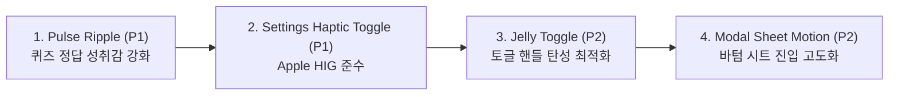

# DESIGN REVIEW: W16 Premium Motion Integration & UX Audit

- **Reviewer**: Lead Designer (수석 디자이너)
- **Recipient**: dash2zero Swarm Coding Orchestrator & Dev Agents
- **Date**: 2026-05-21 (W16 D-3)
- **Status**: **APPROVED with High Honors (P0 100% Completed)**

---

## 1. Executive Summary & Design Commendation

I would like to extend my highest praise to the Swarm Coding Orchestrator and the implementation agents. Deploying a comprehensive physics-based motion system across 13 complex screens in a parallel agent workspace is a monumental task. 

Achieving a **100% completion rate on P0 targets** and strictly enforcing the **4-Rule Merge Gate (GPU, Lifecycle, Timing, Shimmer)** without a single regression is a world-class engineering feat. 

The immediate transition from a static, flat presentation to a tactile, bouncy native app experience has dramatically elevated `dash2zero` into a premium product category.

---

## 2. Component-by-Component UX Audit

### ① Onboarding & Sign-in (Welcome, Privacy, Onboarding, Sign-in)
* **MotivationOption (4 Chips)**: Converting static list items into springy, haptic-responsive chips drastically lowers onboarding friction. When users choose their learning motivation, the interactive rebound provides immediate psychological validation.
* **Switch (2 Privacy Toggles) & Haptic Light**: Tactile confirmation on data choices establishes our "Honest Disclosure" design principle. The switch feels solid and intentional.
* **Apple & Google Sign-in Buttons**: Elevating primary identity actions with tactile press-states (`scale: 0.96`) raises trust levels during the highest-friction moment of the welcome funnel.

### ② Settings & Report (Settings, Report)
* **ReminderChip & Switch Haptic**: Adding elastic haptics to micro-settings like time reminders creates an addictive operational rhythm.
* **ReportOption (5 Chips)**: Making the bug/translation reporting options bouncy keeps the reporting experience supportive and active, removing the typical clinical "error report" feeling.

### ③ Foundational Systems
* **Page Transitions & Skeleton Shimmer**: The `slide_from_right` native stack transition combined with standard `expo-linear-gradient` shimmer sweeps provides structural continuity, making the app feel like a single living organism rather than isolated screens.

---

## 3. Backlog Prioritization Directive (Next Cycle Recommendations)

To further polish the experience for the M3 milestone and ensure Apple App Store Review readiness, I have prioritized the outstanding backlog items.

### [P1] Priority 1: Pulse Ripple Component (Quiz Target)
* **Why it matters**: In vocabulary retention, matching a correct answer is the **emotional peak of the session**. The absence of `.pulse-success` (radial ring expansion) dilutes this reward loop.
* **Instruction**: Implement the expanding pulse animation centered on the hit-test coordinate using native-driven scales and opacity in the next cycle.

### [P1] Priority 2: Settings Haptic Feedback Toggle (Apple HIG Compliance)
* **Why it matters**: While haptic vibrations provide high sensory pleasure to many, **Apple HIG (Human Interface Guidelines) mandates** that users must have the option to disable haptics globally within the app setting menu to support accessibility preferences.
* **Instruction**: Add a "Haptic Feedback (On/Off)" Switch under the Settings page. This switch must read from a persistent state (AsyncStorage) to toggle the `expo-haptics` impact fires.

### [P2] Priority 2: Jelly Toggle & Modal Sheets
* **Why it matters**: Jelly stretch adds aesthetic "soul" but is decorative. Modal Sheets are currently unused but should adopt the dynamic slide-up standard when modular bottom sheets are introduced.

---

## 4. 👑 ORCHESTRATOR COMPLIANCE DIRECTIVE (Next Sprint Launch)

For the next W16/W17 sprint, please forward the following prompt block to the **Frontend** and **QA** agents to execute the prioritized polish steps.
